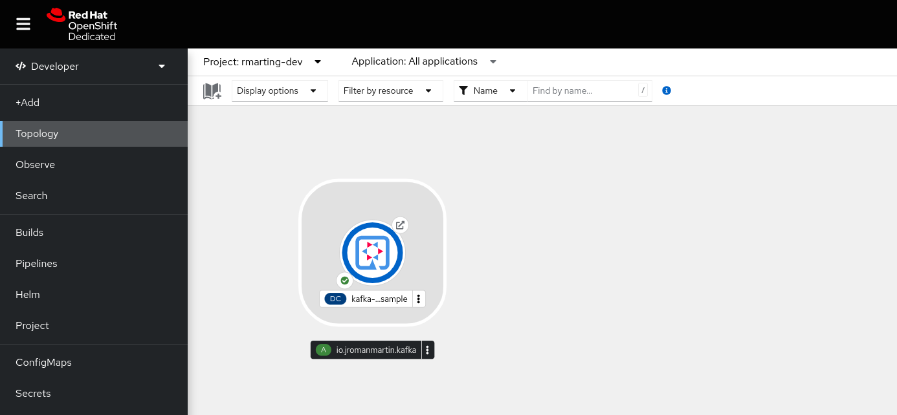
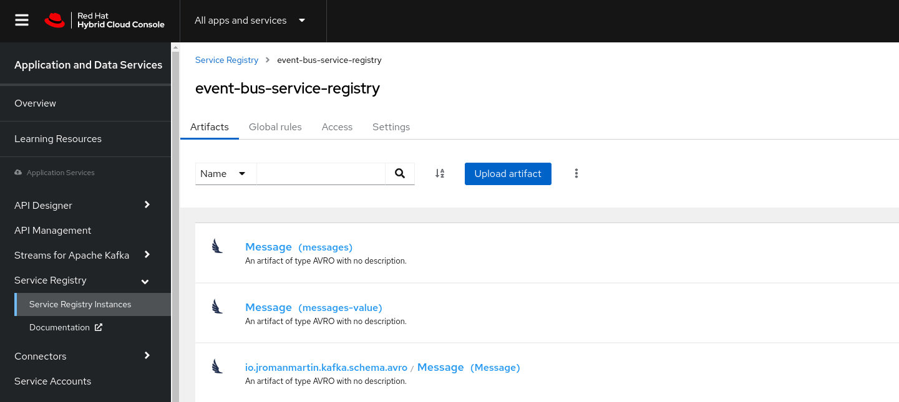

# Kafka Clients Quarkus Edition with Managed Services

This repo is an extended version of the original [one](https://github.com/rmarting/kafka-clients-quarkus-sample) focused
in the integration with the streaming services provided by the
Red Hat Openshift Application Services.

This repo integrates the following managed services:

* [Red Hat Developer Sandbox](https://developers.redhat.com/developer-sandbox) provides
immediate access into an OpenShift cluster to deploy applications.
* [Red Hat OpenShift Streams for Apache Kafka](https://access.redhat.com/documentation/en-us/red_hat_openshift_streams_for_apache_kafka/1/guide/aeb2d53c-870a-4418-867c-1a886e7bc1cb)
is a fully hosted and managed service that provides a cloud service of running 
Apache Kafka brokers. Apache Kafka is an open-sourced distributed event streaming
platform for high-performance data pipelines, streaming analytics, data integration,
and mission-critical applications. 
* [Red Hat OpenShift Service Registry](https://access.redhat.com/documentation/en-us/red_hat_openshift_service_registry/1/guide/0827e812-1062-4950-83c3-d99cb906a8ef)
is a fully hosted and managed service that provides a cloud service of running 
an API and Schema registry instance. Service Registry is a datastore for sharing
standard event schemas and API designs across API and event-driven architectures.
You can use Service Registry to decouple the structure of your data from your
client applications, and to share and manage your data types and API descriptions
at runtime using a REST interface.

Remember that this application is based in [Quarkus](https://quarkus.io/), so you
are getting the best features of OpenShift and Java in the same package ... with
really fast start up ... like a :rocket: 

```text
Oct 21, 2022 2:14:31 PM io.quarkus.bootstrap.runner.Timing printStartupTime
INFO: kafka-clients-quarkus-sample 2.13.3-SNAPSHOT on JVM (powered by Quarkus 2.13.3.Final) started in 3.802s. Listening on: http://0.0.0.0:8080
```

But in 'native' mode, then the applications is a high-fast :rocket: starting in a few milliseconds.

```text
2022-10-21 14:24:32,089 INFO [io.quarkus] (main) kafka-clients-quarkus-sample 2.13.3-SNAPSHOT native (powered by Quarkus 2.13.3.Final) started in 0.169s. Listening on: http://0.0.0.0:8080
```

To deploy this application into OpenShift environment, we use the
amazing [JKube](https://www.eclipse.org/jkube/).

This application deployed in the Red Hat Developer Sandbox looks like this:



## Environment

The environment and services are provided by the different managed services by
Red Hat. It is very easy to start there, you only require to have a Red Hat
Developer account. You could sign [here](https://sso.redhat.com/auth/realms/redhat-external/login-actions/registration?client_id=rhd-web&tab_id=S1NAhgOLEmU).

Once you have your account created and ready, we need to install the
Red Hat OpenShift Application Service CLI (`rhoas`) that will help to
manage all the services from our terminal. Please, follow the instructions
for your platform [here](https://access.redhat.com/documentation/en-us/red_hat_openshift_application_services/1/guide/bb30ee92-9e0a-4fd6-a67f-aed8910d7da3#proc-installing-rhoas_installing-rhoas-cli)

This repo was tested with the following version:

```shell
❯ rhoas version
rhoas version 0.51.4
```

So, we are now ready to log in into the Red Hat OpenShift Application Services:

```shell
rhoas login
```

### Deploying Apache Kafka

This command will create our own instance of Apache Kafka easily:

```shell
rhoas kafka create --name event-bus --use
```

Provisioning a new Apache Kafka instance takes some time (few minutes), but
we could verify the status with:

```shell
rhoas status kafka
```

The `Status` property must be `ready` before continuing these instructions.

Next step is to create the Kafka Topic used by our application:

```shell
rhoas kafka topic create --name messages
```

### Deploying Service Registry

This command will create our own instance of Apache Kafka easily:

```shell
rhoas service-registry create --name event-bus-service-registry --use
```

### Getting Configuration Context

Once our application services are ready we need to get the technical details of
each of them to use in our application.

First we will get the configuration of these services with the following command:

```shell
rhoas generate-config --type env --output-file ./event-bus-config.env --overwrite
```

The `event-bus-config.env` file will contain the right values of our instances using
the following environment variables:

* **KAFKA_HOST** has the bootstrap server connection
* **SERVICE_REGISTRY_URL** has the Service Registry base url or our instance
* **SERVICE_REGISTRY_CORE_PATH** the uri to interact with the Service Registry
* **SERVICE_REGISTRY_COMPAT_PATH** the compact uri of the Service Registry

These properties will be needed by our application in runtime, so we will store
them in a `ConfigMap` in our namespace. This config map will be mounted in our
application deployment manifest.

```shell
oc create configmap event-bus-config --from-env-file=./event-bus-config.env
```

The application services provided have enabled Auth/Authz, so we will require
to have valid credentials to access them. These credentials will be provided
by a Service Account. The Service Account provides a username (Client ID)
and password (Client Secret) to connect to the different services.

To create a Service Account:

```shell
rhoas service-account create \
  --short-description event-bus-service-account \
  --file-format env \
  --output-file=./event-bus-service-account.env --overwrite
```

**NOTE**: The output of that command includes a set of instructions to execute
to grant our service account to the different services created. It is
important to follow them.

The `event-bus-service-account.env` file will contain the right values of our
instances using the following environment variables:

* **RHOAS_SERVICE_ACCOUNT_CLIENT_ID** has the client id.
* **RHOAS_SERVICE_ACCOUNT_CLIENT_SECRET** has the client secret.
* **RHOAS_SERVICE_ACCOUNT_OAUTH_TOKEN_URL** has the OAuth Token service.

Again, these properties will be needed by our application in runtime, so we
will store them in a `Secret` (it is sensible data) in our namespace. This
secret will be mounted in our application deployment manifest.

```shell
oc create secret generic event-bus-service-account --from-env-file=./event-bus-service-account.env
```

To use locally these properties (e.g: to run locally our application), we could load
them with:

```shell
export $(grep -v '^#' event-bus-config.env | xargs -d '\n')
export $(grep -v '^#' event-bus-service-account.env | xargs -d '\n')
```

The different environment variables are integrated in the following files
to use them automatically:

* **pom.xml** file has references to publish the schemas into the Service Registry
* **application.properties** file has references of Apache Kafka and Service Registry

## Publishing Schemas

To register the schemas in Service Registry running in OpenShift:

```shell
./mvnw clean generate-sources -Papicurio
```

The next screenshot shows the schemas registered in the Web Console:

 

## Build and Deploy

To run locally:

```shell
./mvnw compile quarkus:dev
```

Our application should start successfully, connecting to the different
application services provided on the cloud. The REST API section includes
how to test the application.

Or you can deploy into OpenShift platform using
[Eclipse JKube](https://github.com/eclipse/jkube) Maven Plug-ins.

There is a deployment definition in [deployment.yml](./src/main/jkube/deployment.yml) file
to mount the ConfigMap and Secret with the right environment variables of our
services.

This file will be used by JKube to deploy our application in OpenShift.

```yaml
spec:
  template:
    spec:
      containers:
        - envFrom:
            - configMapRef:
                name: event-bus-config
            - secretRef:
                name: event-bus-service-account
```

To deploy the application using the OpenShift Maven Plug-In:

```shell
./mvnw package oc:resource oc:build oc:apply -Popenshift
```

If you want to deploy the native version of this project:

```shell
./mvnw package oc:resource oc:build oc:apply -Pnative,openshift -Dquarkus.native.container-build=true
```

## REST API

The application exposes a simple REST API with the following operations:

* Send messages to a Topic
* Consume messages from a Topic

REST API is available from a Swagger UI at:

```text
http://<OPENSHIFT_ROUTE_SERVICE_HOST>/swagger-ui
```

**NOTE:** This application uses an OpenShift route to access it. If you are
running locally the endpoint is `http://localhost:8080`

To get the route the following command in OpenShift give you the host:

```shell
echo http://$(oc get route kafka-clients-quarkus-sample -o jsonpath='{.spec.host}')
```

There are two groups to manage a topic from a Kafka Cluster.

* **Producer**: Send messageDTOS to a topic 
* **Consumer**: Consume messageDTOS from a topic

### Producer REST API

Sample REST API to send messages to a Kafka Topic.

* **topicName**: Topic Name
* **messageDTO**: Message content based in a custom messageDTO:

Model:

```text
MessageDTO {
  key (integer, optional): Key to identify this message,
  timestamp (string, optional, read only): Timestamp,
  content (string): Content,
  partition (integer, optional, read only): Partition number,
  offset (integer, optional, read only): Offset in the partition
}
```

Simple sample producer command for OpenShift:

```shell
curl -X POST http://$(oc get route kafka-clients-quarkus-sample -o jsonpath='{.spec.host}')/producer/kafka/messages \
-H "Content-Type:application/json" -d '{"content": "Simple message"}' | jq
```

The output should be similar to:

```json
{
  "content": "Simple message",
  "offset": 0,
  "partition": 0,
  "timestamp": 1666361768868
}
```

### Consumer REST API

Sample REST API to consume messages from a Kafka Topic.

* **topicName**: Topic Name (Required)
* **partition**: Number of the partition to consume (Optional)
* **commit**: Commit messaged consumed. Values: true|false

Simple Sample consumer command in OpenShift:

```shell
curl -v "http://$(oc get route kafka-clients-quarkus-sample -o jsonpath='{.spec.host}')/consumer/kafka/messages?commit=true&partition=0" | jq
```

The output

```json
{
  "messages": [
    {
      "content": "Simple message",
      "offset": 0,
      "partition": 0,
      "timestamp": 1666361768868
    },
    ...
    {
      "content": "Simple message",
      "offset": 3,
      "partition": 0,
      "timestamp": 1666361833929
    }
  ]
}
```

That's all folks! You have been deployed a full stack of components to produce
and consume checked and valid messages using a schema declared. Congratulations!.

## Cleaning Resources

If you need to clean up your resources, then it is very easy using the same tools
but not in this way:

Undeploying our application:

```shell
./mvnw oc:undeploy -Popenshift -DskipTests
```

Deleting the configuration resources:

```shell
oc delete cm event-bus-config
oc delete secret event-bus-service-account
```

Deleting the application services:

```shell
rhoas service-registry delete --name event-bus-service-registry -y
rhoas kafka delete --name event-bus -y
```

To clean your service account

```shell
rhoas service-account delete -y \
  --id $(rhoas service-account list | grep event-bus-service-account | awk -F ' ' '{print $1}')
```

## Main References

* [Quarkus - Building applications with Maven](https://quarkus.io/guides/maven-tooling)
* [Red Hat OpenShift Streams for Apache Kafka](https://developers.redhat.com/products/red-hat-openshift-streams-for-apache-kafka/overview)
* [Connect to OpenShift application services with contexts](https://developers.redhat.com/articles/2022/07/18/simplify-client-connection-configurations-service-contexts#)
* [Getting started with Red Hat OpenShift Streams for Apache Kafka](https://developers.redhat.com/articles/2021/07/07/getting-started-red-hat-openshift-streams-apache-kafka)
* [Get started with OpenShift Service Registry](https://developers.redhat.com/articles/2021/10/04/get-started-openshift-service-registry)
